# Tastily
Full-stack application for ordering and food delivery, my final project for my university PostgreSQL + Spring Boot Java + Angular TypeScript

### Project Images

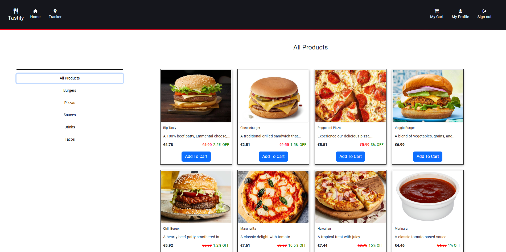

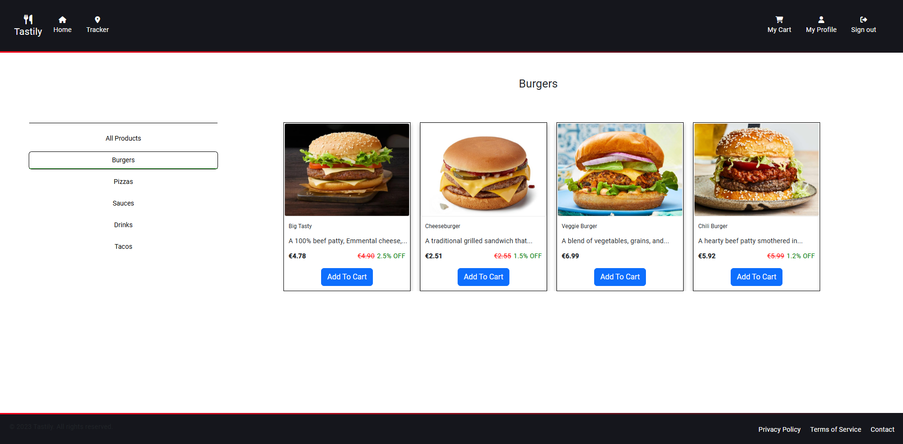

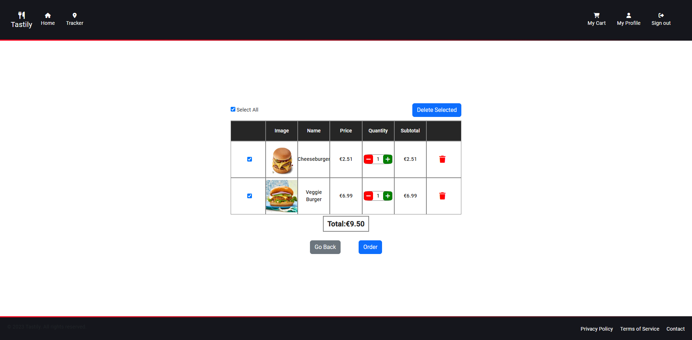

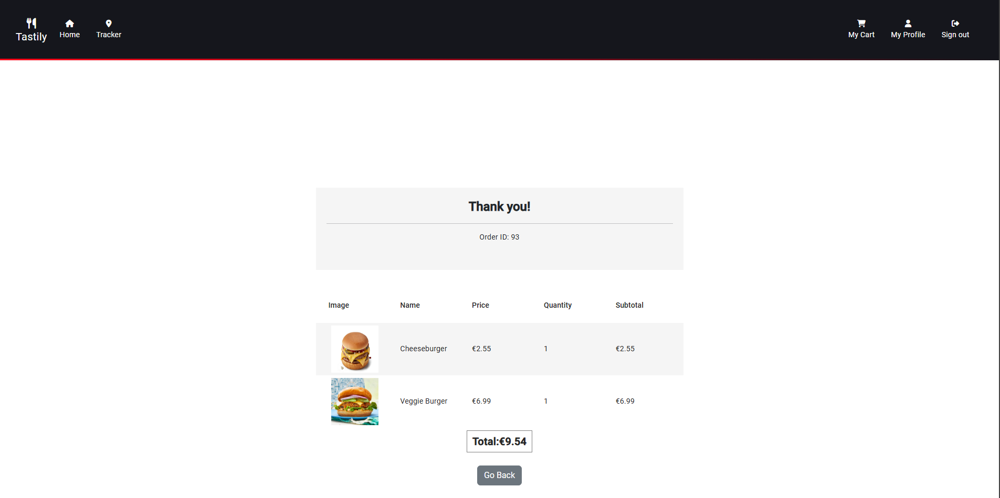

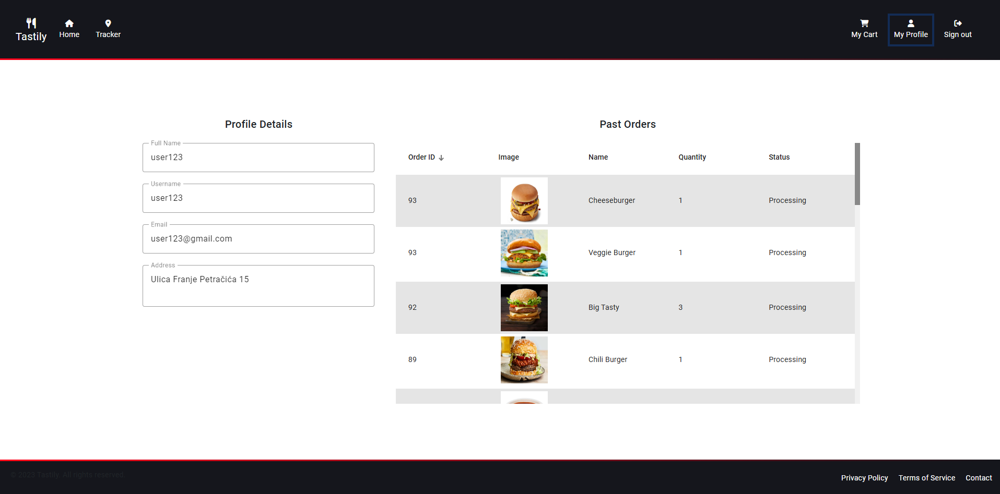

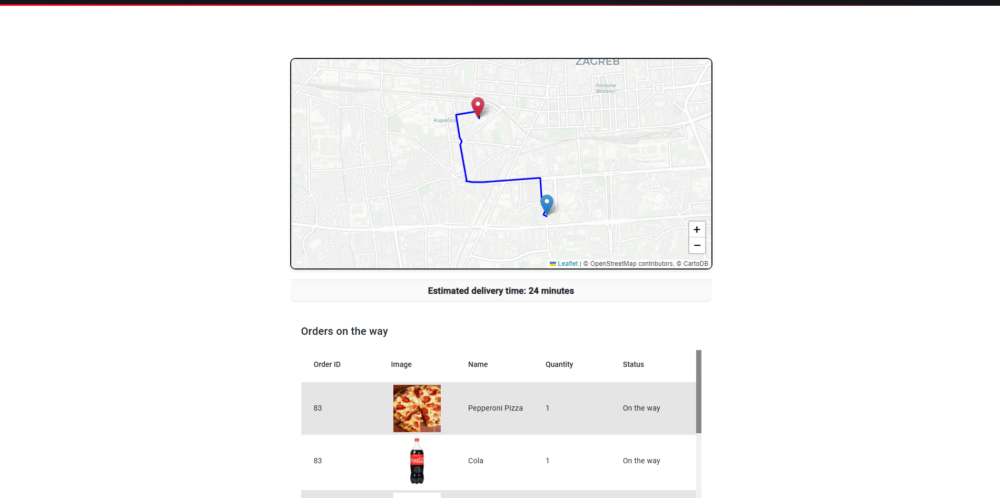

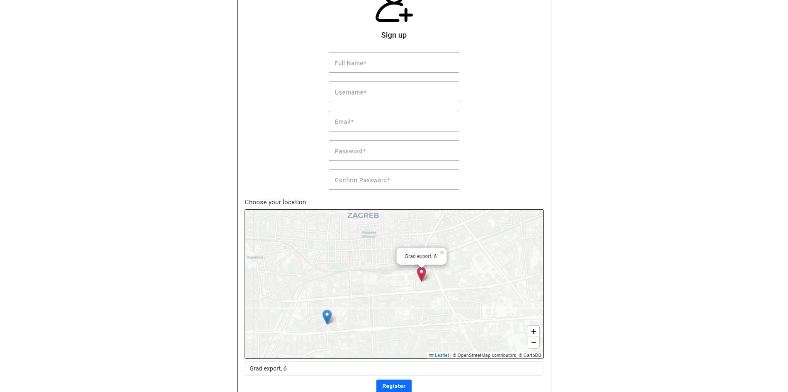

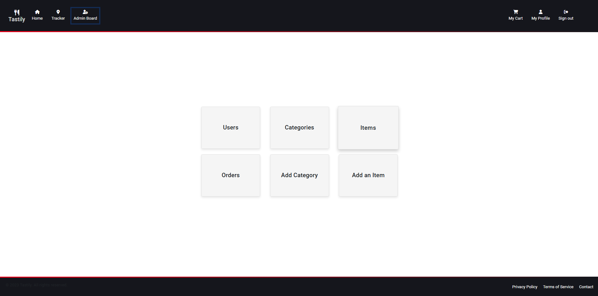

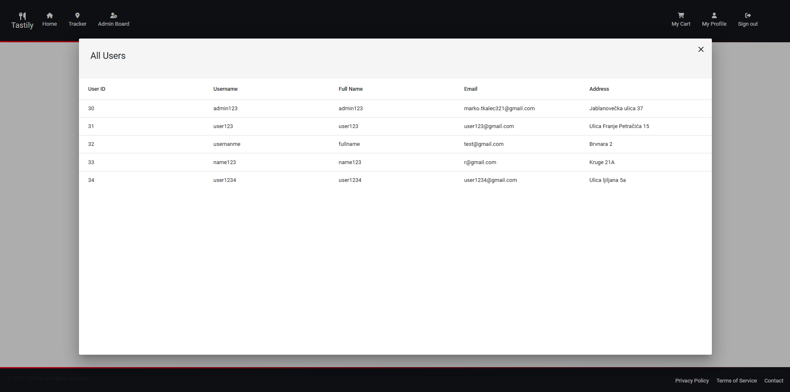

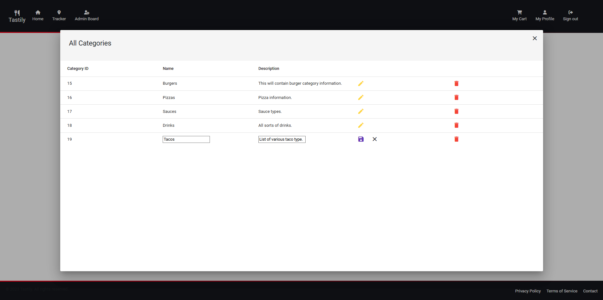

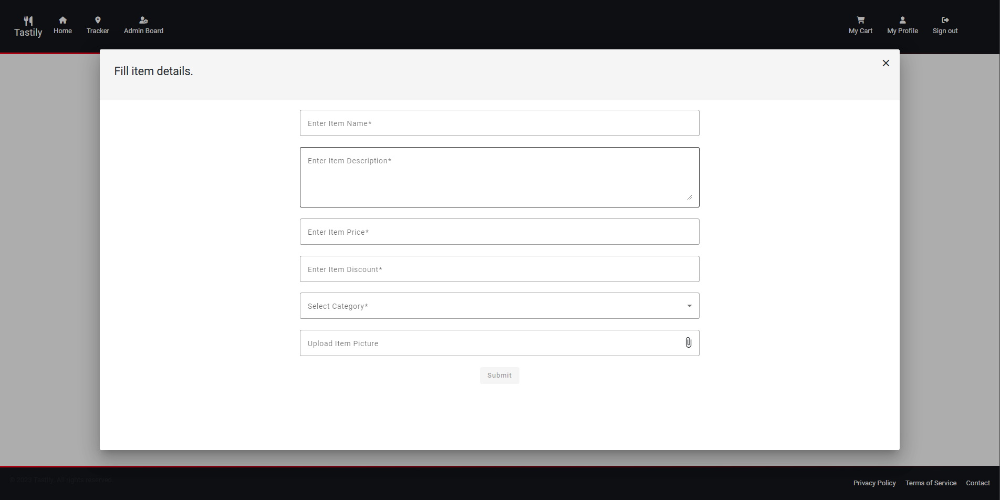

## Project Description
Tastily is a full stack web application intended for users to buy items, order them and to display the fastest route to user's address with approximate time of delivery.
### Technologies
- **PostgreSQL** relational database for storing data
- Backend with **Spring Boot** in **Java**
- Frontend with **Angular** in **TypeScript**

### API usage
- Tracker tab with interactive map powered by [Leaflet](https://leafletjs.com/ "Leaflet")
- Routing and approximate time calculated using [GraphHopper Directions API](https://www.graphhopper.com/ "GraphHopper Directions API")

## How to run this project
- To run this project, download [postgreSQL](https://www.postgresql.org/ "postgreSQL") and import the .sql file provided in the repository
- Install [IntelliJ IDEA](https://www.jetbrains.com/idea/ "IntelliJ IDEA") (recommended) or other editors and open *frontend* and *backend* files separately
- Run *ng build* to build this project
- Navigate to http://localhost:4200

## Features in this project
- Backend in Spring Boot uses CRUD operations to interact with database
- Frontend part is separated from the backend and is connected with it using port :8080
- Register and login page using Spring Security
- Auth and many other guards in Angular to protect the unwanted access to the routes
- Interactive page for user to add items to the cart
- User's profile with information and all of the past orders
- Only items that have status "On the way" are shown below the map
- Admin Board tab appears to those with admin priviledges
- Adding, editing and deleting categories and items as an admin
- Changing order's status and a list of all users and their data
- Most of the application's design is used from *@angular/material* library

## Demonstration

https://github.com/MarkoTkalec321/Tastily/assets/123999173/2ad0547d-95bd-4a1d-8ea6-c628eb8ce459

